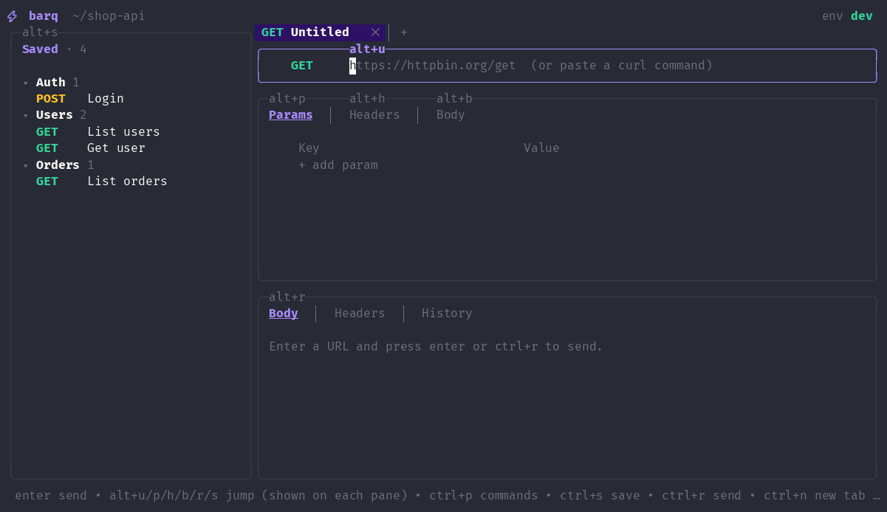

# barq

An API client for the terminal: a keyboard- and mouse-driven TUI for people,
and a CLI that lets scripts and AI agents do the same things **without ever
seeing your secrets**.

Requests, folders, environments and run history are saved per project
directory in `~/.barq`, never inside the project.



## Install

Requires Go 1.24 or newer.

```sh
go install github.com/iskaa02/barq@latest
```

This puts `barq` in `$(go env GOPATH)/bin` (usually `~/go/bin`); make sure
that's on your `PATH`. Check with `barq --version`.

To build from a clone instead: `go build -o barq .`

## The TUI

Run `barq` in a project directory (optionally `barq <url>` or `barq "curl …"`).

| Keys | |
|---|---|
| `ctrl+p` | command palette: every action, saved request, tab and folder |
| `alt+u/p/h/b/r/s` | jump to URL / params / headers / body / response / sidebar (also `ctrl+x` + letter) |
| `ctrl+r`, `enter` in URL | send |
| `ctrl+s` | save · `ctrl+n` new tab · `ctrl+w` close tab · `alt+←/→` switch tab |
| `ctrl+x ctrl+e` | edit the focused field in `$EDITOR` |
| `alt+e` / `alt+v` | switch environment / edit its variables |
| `/` and `\|` in the response | find / jq filter |
| `/` in the sidebar | filter saved requests |

Features: tabs, folders, environments with `{{variables}}`, query params and
multipart form-data (`@file`), response history with per-run diffs, captures
(`token = .data.accessToken` after each successful send), curl import/export,
OpenAPI 3 import, and live updates when the CLI changes the workspace.

## The CLI (for scripts and AI agents)

```sh
barq ai                                   # the full guide, written for agents
barq ls --json
barq new "Auth/Login" --method POST --url '{{baseUrl}}/auth/login' \
    -H 'Content-Type: application/json' --body @login.json \
    --capture token=.data.accessToken
barq run "Auth/Login"                     # stores {{token}} as a secret
barq run "Orders/List orders" --jq '.data[0]' --json
barq env set dev token - --secret         # value from stdin
barq import openapi.json
```

**Large responses.** Bodies are kept whole, in history too, scrubbed of
secrets. The TUI shows the first 10 MB, and `barq run` prints the first 1 MB
and says where the rest is. Read it with `barq history body <run-id>` and
`--jq`, `--grep`, `--lines`, `--bytes` or `--path`, or save it with
`barq run … -o file`. Reading stops at 1 GB by default (`--max-body`,
`BARQ_MAX_BODY_MB`, 0 for no limit). History stays under 500 MB per project
(`BARQ_HISTORY_MB`) by deleting the oldest bodies first and keeping their runs.

To let an agent such as Claude Code use it, add to the project's `CLAUDE.md`:

> Use `barq` for HTTP/API calls in this project. Run `barq ai` first to learn
> how. Never put real tokens in requests; use `{{variables}}` and captures.

## Secrets

- Variables named like credentials (`token`, `password`, `api_key`, …), or
  marked secret (`ctrl+l` in the variables editor, `--secret` in the CLI),
  are stored in the OS keyring (Secret Service/KWallet, Keychain, Credential
  Manager). Set `BARQ_KEYRING=off` to keep them in the workspace file instead
  (barq shows a warning in the title bar).
- CLI output never contains secret values, credential headers, or
  credential-like fields in bodies and query strings. `--reveal` works only
  for a person at an interactive terminal.
- History on disk is scrubbed the same way.
- Environments can be **protected** (OpenAPI imports protect production).
  In a protected environment the CLI asks a person at the terminal before
  sending anything that can change something (POST, PUT, PATCH, DELETE…);
  GET, HEAD and OPTIONS go through. `barq env protect prod --all` asks
  before every request. The prompt shows the real method and URL, with
  secrets hidden, and one keypress answers it:

  ```
  ⚠ Sending Delete user in the protected environment "prod"
    DELETE https://api.example.com/users/42
  Continue? [y/N]
  ```

  It's read from the terminal itself, so piped input can't answer it.
  Unprotecting an environment or making a secret variable visible needs
  the same confirmation.

**Limits.** Redaction keeps secrets out of what barq prints and stores. It
can't stop an agent from deliberately sending `{{token}}` to a server it
controls, or from reading the keyring itself (e.g. `secret-tool`). Protected
environments and your agent's own permission prompts are the safeguards for
those.

## Code layout

```
main.go          starts the CLI or the TUI
internal/core    workspaces, environments, secrets, history, sending,
                 redaction, curl and OpenAPI import (no UI code)
internal/cli     the `barq <command>` interface
internal/tui     the Bubble Tea interface
```

`cli` and `tui` both build on `core`; `core` imports neither.

## License

MIT — see [LICENSE](LICENSE).
